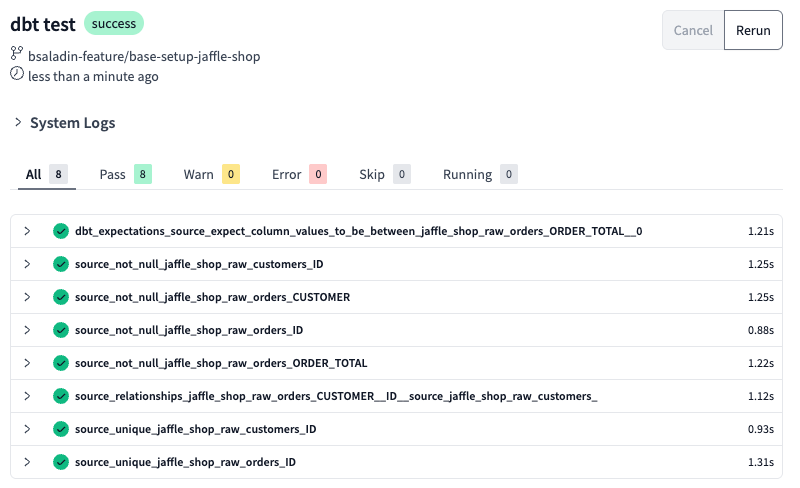

# Data Quality Testing in dbt

## Introduction

Ensuring data integrity is critical for reliable analytics. **dbt allows automated data testing** to catch inconsistencies **before** they impact downstream reports. By implementing **column-level tests**, we can enforce business rules and improve trust in our data models.

dbt provides built-in test types and supports custom tests through packages like **dbt-utils** and **dbt-expectations**.

---

## 1. Defining Data Quality Tests

    In dbt, tests are defined within the `schema.yml` files alongside the models they validate.

### **Example: Basic Tests on the `stg_orders` Model**
```yaml
models:
    - name: stg_orders
      description: "Staging model for orders"
      columns:
        - name: order_id
          description: "Unique identifier for each order"
          tests:
            - unique
            - not_null
        - name: order_total
          description: "Total value of the order"
          tests:
            - not_null
            - dbt_utils.accepted_range:
                min_value: 0
```

!!! note "Test Types"
    - unique: Ensures that order_id does not contain duplicates
    - not_null: Ensures order_total and order_id have no missing values
    - accepted_range: Ensures order_total is always ≥ 0 (i.e., no negative totals)

---

## 2. Running Tests

Once tests are defined, they can be executed with:

```bash
dbt test
```

This command will:

- Validate all tests in the project.
- Identify any failing records.
- Provide a summary of passed/failed tests.

Example Output:

Timestamp | Status |
--- | --- |
16:12:45 | 1 of 3 PASS unique test on stg_orders.order_id
16:12:45 | 2 of 3 PASS not_null test on stg_orders.order_total
16:12:45 | 3 of 3 FAIL accepted_range test on stg_orders.order_total

❌ A failure on accepted_range means there are negative order totals that need fixing.

---


## 3. Add data quality tests

Add data quality tests to your dbt project into the source.yml file

```yaml
version: 2

sources:
  - name: jaffle_shop
    database: PSA
    schema: JAFFLE_SHOP
    description: Mock data
    tables:
      - name: raw_customers
        description: One record per person who has purchased one or more items
        columns:
          - name: ID
            tests:
              - unique  # Ensures no duplicate Order IDs
              - not_null  # Ensures no NULL values        
      - name: raw_orders
        description: One record per order (consisting of one or more order items)
        columns:
          - name: ID
            tests:
              - unique  # Ensures no duplicate Order IDs
              - not_null  # Ensures no NULL values
          - name: CUSTOMER
            tests:
              - not_null  # Ensures all orders are linked to a customer
              - relationships: # Ensures every CUSTOMER(_ID) in raw_orders exists in raw_customers as ID
                  to: source('jaffle_shop', 'raw_customers')
                  field: ID
          - name: ORDER_TOTAL
            tests:
              - not_null
              - dbt_expectations.expect_column_values_to_be_between:
                  min_value: 0  # Allows 0 and positive values
                  severity: warn  # Logs a warning instead of failing the run
      - name: raw_items
        description: Items included in an order
      - name: raw_stores
        description: All stores in from jaffle shop
      - name: raw_products
        description: One record per SKU for items sold in stores
      - name: raw_supplies
        description: One record per supply per SKU of items sold in stores
```

---

## 4. Add dbt-expectations for advanced testing

Add package dbt-expectations to your packages.yml file

```yaml
packages:
  - package: dbt-labs/dbt_utils
    version: [">=1.0.0", "<2.0.0"]
  - package: calogica/dbt_expectations
    version: [">=0.10.1", "<0.11.0"]
```

Run dbt deps to install the package

```bash
dbt deps
```

---

## 5. Run the tests with:

```bash
dbt test
```


Great, all tests passed!🎉

Commit the changes to your repository. Add a commit message `Add data quality tests`.

**Merge the branch into main.**


---
## 6. Advanced Granular Test Configuration

dbt allows defining granular conditions within test configurations. This ensures flexibility and targeted validation for business rules.

**Example: Conditional Severity for order_total**

```yaml

models:
  - name: stg_orders
    columns:
      - name: order_total
        tests:
          - not_null:
              config:
                severity: error
                error_if: ">50"
                warn_if: ">0"
                where: "status IN ('completed', 'shipped')"

```

✅ Dynamic thresholds:

- error_if: ">50" → Fails if order_total exceeds 50
- warn_if: ">0" → Raises a warning if order_total is greater than 0
- where: "status IN ('completed', 'shipped')" → Applies only to completed & shipped orde


---
## 7. Handling Test Failures

When a test fails, dbt provides detailed logs with failing records.

- Identifying Failed Records
- Use --store-failures to persist failed tests in the database:
- dbt test --store-failures
- Results are stored in the dbt_test__audit schema for further investigation.

Example: Investigating Failures
```sql
SELECT *
FROM analytics.dbt_test__audit.failed_tests
WHERE test_name = 'accepted_range_test'
```


This helps teams quickly identify, debug, and fix data issues.

🎉 Next Steps

By integrating dbt’s testing capabilities, we can automate data validation and prevent bad data from entering downstream reports.

🔗 Continue to: 🔗 **Continue to:** [dbt Documentation & Deployment](dbt-deployment.md)

