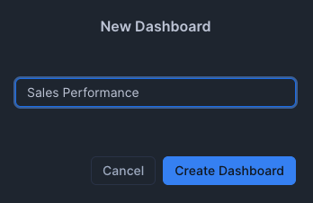
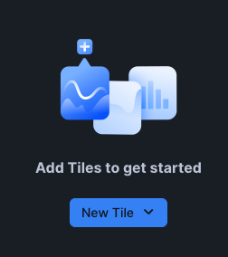
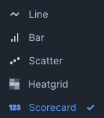
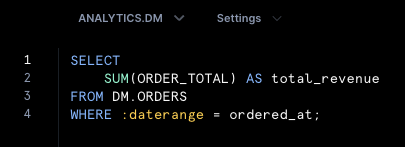
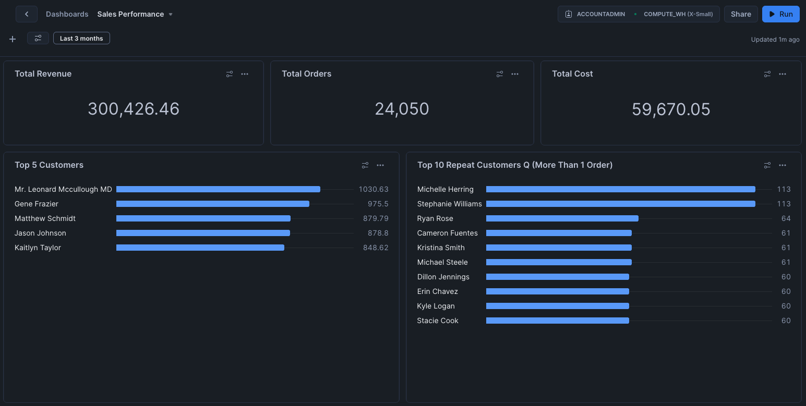

# Data Visualization in Snowflake

## Introduction

Once our data has been **ingested, transformed, and validated**, the next step is **visualizing it** to enable better business insights.  
**Snowflake Dashboards** provide a **built-in, out-of-the-box visualization tool**, allowing users to explore data without third-party BI tools.  

By the end of this section, you will:

- Have a **fully built dashboard in Snowflake**  
- Use **interactive charts** for business analysis  


---

## 1. Creating a New Dashboard in Snowflake

To start visualizing your data:

1. **Go to the Snowflake UI**, navigate to the top left and **+Create > Dashboard**. Give it a name like `Sales Performance`. **Create Dashboard**.

   

2. Click on **"New Tile** and select **"Create New Dashboard"**.

    

    and select **"From SQL Worksheet"**.

    

3. **Set the Context** (`ANALYTICS.DM`).

   

Proceed to the next step to create a tile (chart) for the dashboard.

---

## 2. Creating a Tile (Chart) for the Dashboard

1. Enter your SQL query in the **SQL Worksheet** and rename the sheet at the top in the middle.

    

```sql title="KPI Tota Revenue"
SELECT
    SUM(ORDER_TOTAL) AS total_revenue
FROM orders;
```
 or if you want to be more explicit:

```sql title="KPI Total Revenue"
SELECT
    SUM(ORDER_TOTAL) AS total_revenue
FROM DM.ORDERS;
```

??? example "Additional Examples"
    **KPIs**
    ```sql title="KPI: Total Revenue"
    SELECT 
        SUM(ORDER_TOTAL) AS TOTAL_REVENUE
    FROM ANALYTICS.DBT_BSALADIN_DM.ORDERS;
    ```

    ```sql title="KPI: Total Customers"
    SELECT 
        COUNT(DISTINCT CUSTOMER_ID) AS TOTAL_CUSTOMERS
    FROM ANALYTICS.DBT_BSALADIN_DM.CUSTOMERS;
    ```

    ```sql title="KPI: Total Orders"
    SELECT 
        COUNT(*) AS TOTAL_ORDERS
    FROM ANALYTICS.DBT_BSALADIN_DM.ORDERS;
    ```

    ```sql title="KPI: Average Order Value (AOV)"
    SELECT 
        SUM(ORDER_TOTAL) / NULLIF(COUNT(*), 0) AS AVG_ORDER_VALUE
    FROM ANALYTICS.DBT_BSALADIN_DM.ORDERS;
    ```

    ```sql title="KPI: Repeat Customer Rate"
    SELECT 
        COUNT(CASE WHEN COUNT_LIFETIME_ORDERS > 1 THEN CUSTOMER_ID END) * 100.0 
        / COUNT(*) AS REPEAT_CUSTOMER_RATE
    FROM ANALYTICS.DBT_BSALADIN_DM.CUSTOMERS;
    ```
    **Line Charts**
    ```sql title="Line Chart: Revenue Trend (Daily)"
    SELECT 
        DATE_TRUNC('DAY', ORDERED_AT) AS ORDER_DATE, 
        SUM(ORDER_TOTAL) AS DAILY_REVENUE
    FROM ANALYTICS.DBT_BSALADIN_DM.ORDERS
    GROUP BY ORDER_DATE
    ORDER BY ORDER_DATE;
    ```

    ```sql title="Line Chart: Orders Trend (Daily)"
    SELECT 
        DATE_TRUNC('DAY', ORDERED_AT) AS ORDER_DATE, 
        COUNT(*) AS DAILY_ORDERS
    FROM ANALYTICS.DBT_BSALADIN_DM.ORDERS
    GROUP BY ORDER_DATE
    ORDER BY ORDER_DATE;
    ```

    ```sql title="Line Chart: New vs Returning Customers (Monthly)"
    SELECT 
        DATE_TRUNC('MONTH', FIRST_ORDERED_AT) AS MONTH,
        COUNT(CASE WHEN COUNT_LIFETIME_ORDERS = 1 THEN CUSTOMER_ID END) AS NEW_CUSTOMERS,
        COUNT(CASE WHEN COUNT_LIFETIME_ORDERS > 1 THEN CUSTOMER_ID END) AS RETURNING_CUSTOMERS
    FROM ANALYTICS.DBT_BSALADIN_DM.CUSTOMERS
    GROUP BY MONTH
    ORDER BY MONTH;
    ```
    **Bar Charts**
    ```sql title="Bar Chart: Revenue by Customer Type"
    SELECT 
        CUSTOMER_TYPE,
        SUM(LIFETIME_SPEND) AS TOTAL_REVENUE
    FROM ANALYTICS.DBT_BSALADIN_DM.CUSTOMERS
    GROUP BY CUSTOMER_TYPE
    ORDER BY TOTAL_REVENUE DESC;
    ```

    ```sql title="Bar Chart: Revenue by Location"
    SELECT 
        LOCATION_ID, 
        SUM(ORDER_TOTAL) AS LOCATION_REVENUE
    FROM ANALYTICS.DBT_BSALADIN_DM.ORDERS
    GROUP BY LOCATION_ID
    ORDER BY LOCATION_REVENUE DESC;
    ```

    ```sql title="Bar Chart: Revenue by Product Category (Food vs. Drink)"
    SELECT 
        CASE 
            WHEN IS_FOOD_ITEM = 1 THEN 'Food' 
            WHEN IS_DRINK_ITEM = 1 THEN 'Drink' 
            ELSE 'Other' 
        END AS CATEGORY,
        SUM(PRODUCT_PRICE) AS TOTAL_REVENUE
    FROM ANALYTICS.DBT_BSALADIN_DM.ORDER_ITEMS
    GROUP BY CATEGORY
    ORDER BY TOTAL_REVENUE DESC;
    ```

    ```sql title="Bar Chart: Most Popular Products (Top 10)"
    SELECT 
        PRODUCT_ID, 
        COUNT(*) AS TOTAL_SALES, 
        SUM(PRODUCT_PRICE) AS TOTAL_REVENUE
    FROM ANALYTICS.DBT_BSALADIN_DM.ORDER_ITEMS
    GROUP BY PRODUCT_ID
    ORDER BY TOTAL_SALES DESC
    LIMIT 10;
    ```

    ```sql title="Profitability: Gross Profit by Order"
    SELECT 
        ORDER_ID, 
        SUM(PRODUCT_PRICE - SUPPLY_COST) AS GROSS_PROFIT
    FROM ANALYTICS.DBT_BSALADIN_DM.ORDER_ITEMS
    GROUP BY ORDER_ID
    ORDER BY GROSS_PROFIT DESC;
    ```

    ```sql title="Profitability: Profit Margin (Overall)"
    SELECT 
        SUM(PRODUCT_PRICE - SUPPLY_COST) * 100.0 / SUM(PRODUCT_PRICE) AS PROFIT_MARGIN
    FROM ANALYTICS.DBT_BSALADIN_DM.ORDER_ITEMS;
    ```

2. Click **Run** to preview the results.

    Run the query by pressing on Win CTRL + Enter, Mac CMD + Enter or by clicking the **Run** button in the top right.

---

## 3. Choosing a Chart Type

1. **Click on the "Chart" tab** to visualize the data.
2. **Select a Chart type**:
   - **Line Chart** – Show trends over time.
   - **Bar Chart** – Compare total orders by status.
   - **Scatter Plot** – Analyze the relationship between order total and quantity.
   - **Heat Grid** – Visualize order distribution.
   - **Scorecard** – Display a single KPI value.

    

3. **Add the Tile to your Dashboard** by clicking on **"Return to <dashboard_name>"**.

    

Repeat this process to add more tiles to your dashboard.

---

## 4. Enhancing the Dashboard with Filters

1. **Select a Tile** and **Edit Query**.

    If you select the filter icon in the top left, 

    

    you can see which filters are available by default, 

    

    along with the option to add your custom filters.


2. **Add a Filter** to the query.

    


    ```sql linenums="1"
    SELECT
        SUM(ORDER_TOTAL) AS total_revenue
    FROM DM.ORDERS
    WHERE :daterange = ordered_at;
    ```

2. **Return to your Dashboard** and repeat that process for other tiles to add filters.

    !!! note "Dashboard Filters"
        Filters can be applied to multiple tiles, allowing users to interactively explore data. You can control the filter at the top left.
        
        

3. **Customize the layout** by dragging and resizing tiles for better clarity. Congratulations on building your first Snowflake dashboard!

    

✅ **Your dashboard is now live and interactive!**  
Users can **filter, explore and share insights** directly within Snowflake.


---

## 🎉 This is the end of the Hands-On Lab. 🎉


🔗 **For more References, go to:** [Further Resources](resources.md)


