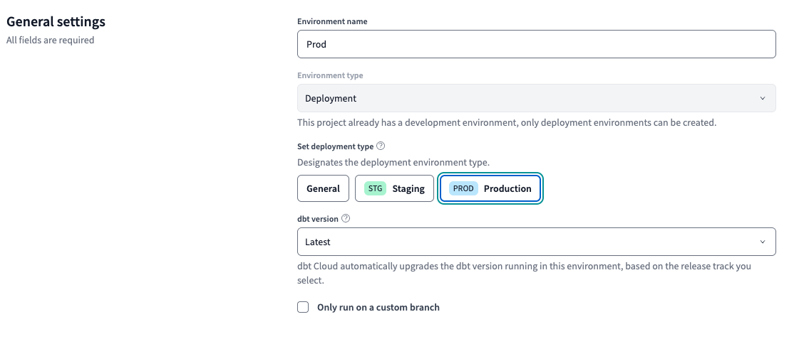
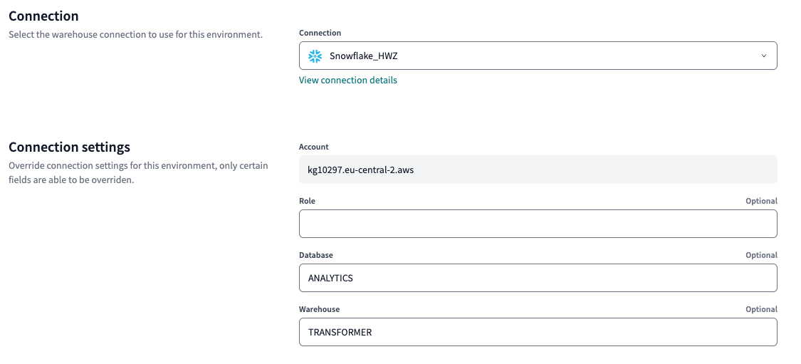
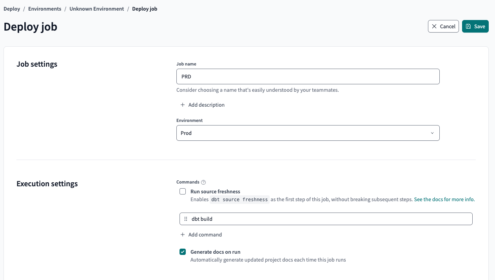
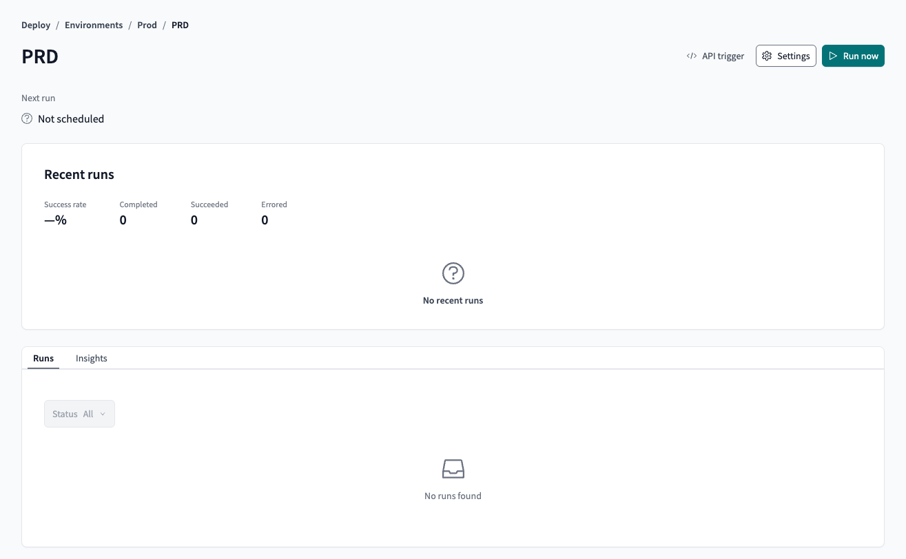
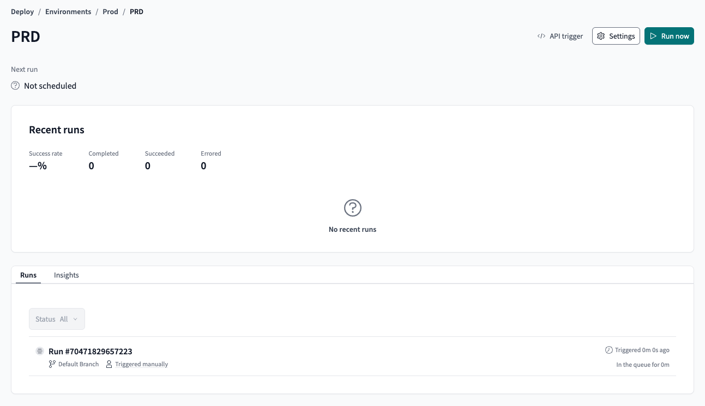

# dbt Deployment & Documentation

## Introduction

Deploying dbt models effectively ensures that transformations run on a **scheduled basis**, providing fresh and reliable data to downstream analytics.

Additionally, **documentation** serves as a **single source of truth**, helping teams understand **data lineage, model definitions, and test coverage**.

At the moment, the Explore section in dbt Cloud is empty. Let's **deploy our models** and **generate documentation** to populate it.

 
---

## 1. Setting Up a Production Environment

A production environment ensures that **only tested, validated models** are exposed to analysts.

### **Steps to Set Up a Production Environment**
1. **Go to dbt Cloud** → Click **Deploy** > **Environments**.
2. **Create a New Environment**:
   - **Name**: `PRD`
   - **Deployment type**: `Production`
   - **Connection**: `Snowflake_HWZ`
   - **Deployment credentials**: Use the Snowflake credentials.
   - **Schema**: `default`

    

    

3. **Test the Connection** to ensure successful setup.

        

4. **Save** the environment.

---

## 2. Setting Up a Production Deploy Job

Go to the bottom right `+ Create job`

Select `Deploy job`

Add the following details:

- **Job name**: `PRD`
- **Environment**: `Prod`
- **Generate docs on run**: [x]

    

- **Target name**: `PRD`
- **Threads**: `16`

    

**Save** the job.

**Run now** to deploy the models to the production environment.

Success! The models are now deployed to the production environment and the documentation is generated.

Go to the **Explore** section to view the documentation.

Since we haven’t added many .yml files, tests, or other features yet, the documentation is not very detailed. But this will get richer as we add more features to our dbt project.

---

## 🎉 Next Steps

Your dbt project is now **automated, tested, and documented**!  
Proceed to **building dashboards** with your transformed data.

🔗 **Continue to:** [Building Dashboards with Snowflake](data-visualization.md)