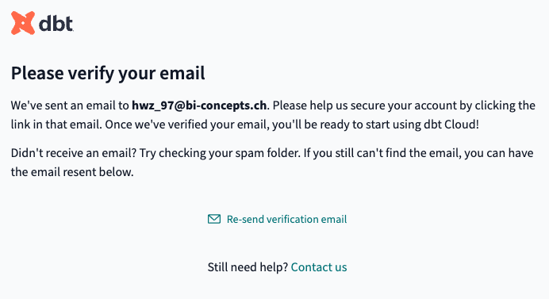
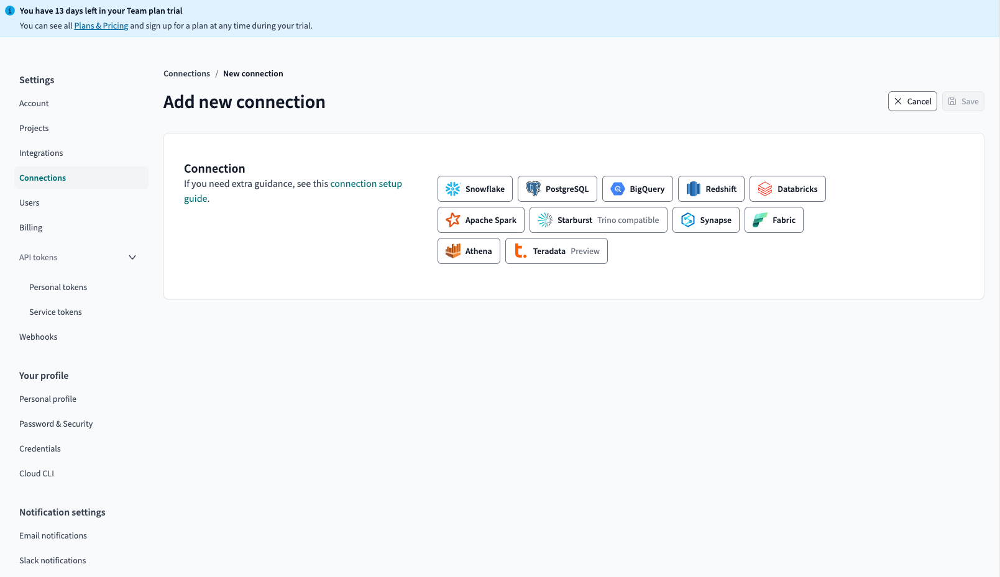
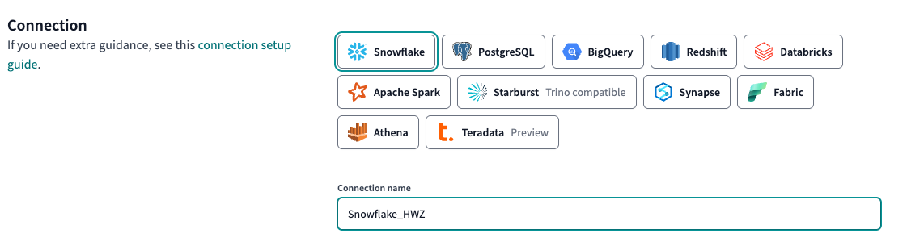
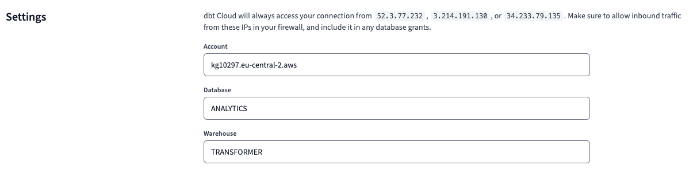
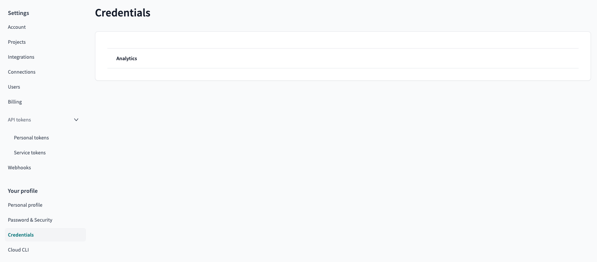
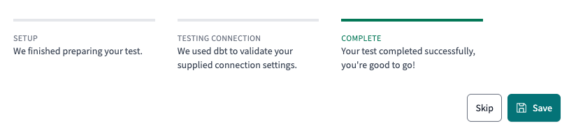
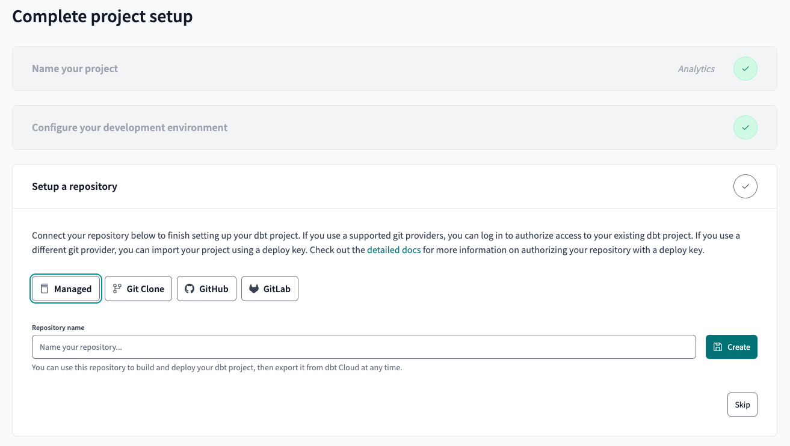
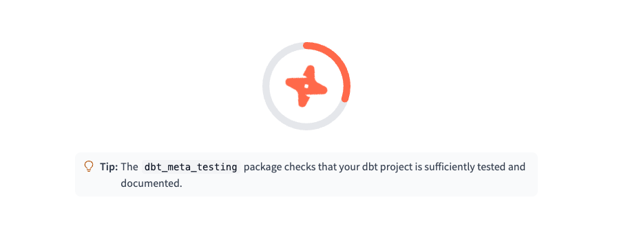
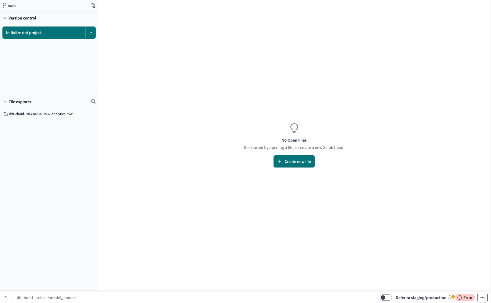
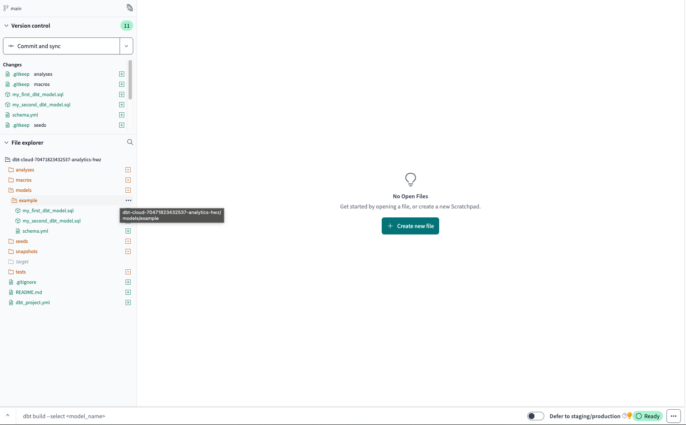

# dbt Cloud Setup

## 1. Create a dbt Cloud Account
   1. To start using dbt Cloud, sign up for an account on the [dbt Cloud website](https://cloud.getdbt.com/){:target="_blank"}. **Start free trial**.

    !!! note "Note down dbt credentials"
        Add username and password to your text file.

      

   2. You will receive an email for the verification process.

      

      Click on the **Verify your email address** to confirm your account.

      

   3. Account setup complete! You can dismiss any pop-ups that might appear.

      

---

## 2. Complete the project setup
dbt Cloud will per default set up a new project called `ANALYTICS`, which we will leverage for our lab.

   1. Select dropdown for **"Connection"**. **Add new connection**.

      

   2. Select your data warehouse `Snowflake`.

      

   3. Fill out the form.

      

      

---

## 3. Connect dbt Cloud to Snowflake with adding your developer credentials

   Go back to the **Dashboard** on the top left corner to configure your development environment.

   To enable dbt transformations, you need to add the development credentials to your connection for dbt Cloud to your Snowflake instance:

   1. Choose **Snowflake_HWZ** as your Connection.

      

   2. Enter the required Snowflake credentials:
      - Username from your snowflake account
      - Password from your snowflake account
      - Schema (leave the default)
      - Target name (leave: default)
      - Threads set to 16 (XS Warehouse starts with 8 threads)

      

      **Test Connection** to verify the connection.

   3. Save Development credentials if successful.

         

---

## 4. Setup the Project Repository to complete the Project Setup
   For simplicity, we are going to use the dbt Cloud IDE to manage our project repository.

   1. Select **Managed** and add a name for your repository.

      

      

   2. Success - Let's go to **Start developing in the IDE**

      

      

---

## 5. Initialize your Analytics Project

The initialization creates the following project structure:

      📦 your_dbt_project
      ├── 📂 analyses
      ├── 📂 macros
      ├── 📂 models
      ├── 📂 seeds
      ├── 📂 snapshots
      ├── 📂 target
      ├── 📂 tests
      ├── 📄 .gitignore
      ├── 📄 README
      └── 📄 dbt_project

   1. Ignore the upcoming pop-ups.

      

   2. **Initialize dbt project** by clicking on the button on the top left.

      

   3. Initialization comes with an example model, which we do not care about. **Delete** the example model `.models/example`.

      

      

   4. **Commit and sync** the changes.

      

      Add a message like `Initial commit` and hit **Commit changes**.

      

   5. **Success** - your dbt project is now ready for development.

      

---

## 🎉 Next Steps
Now that dbt Cloud is configured, proceed to setting up transformations and version control.

🔗 **Continue to:** [Data loading with Fivetran](fivetran-setup.md)