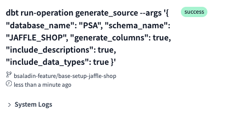
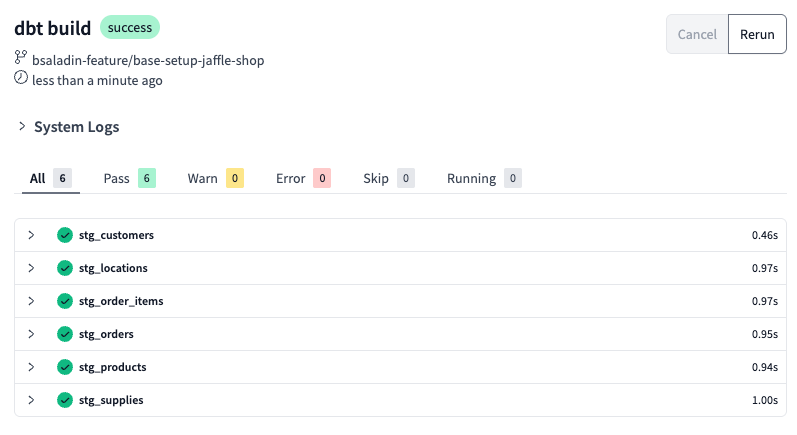
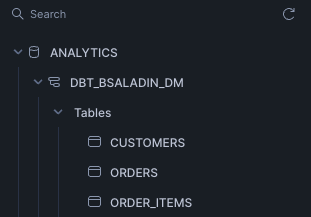

# dbt Transformation

## Introduction

In today’s data-driven world, organizations generate vast amounts of information from various sources—transactional systems, IoT devices, third-party APIs, and more. However, raw data alone is **not enough**. Without proper curation, governance, and accessibility, businesses struggle with **inconsistent reporting, poor data quality, and unscalable analytics workflows**.

This is where **data warehousing** plays a crucial role. A modern data warehouse, built on platforms like **Snowflake**, acts as a **central repository** for structured, semi-structured and unstructured data, ensuring **consistency, security, and efficiency/automation** in analytics and decision-making.

### **Key Benefits of a Data Warehouse**
✅ **Data Curation & Standardization** – Transform raw data into well-modeled, analytics-ready datasets  
✅ **Automation & Orchestration** – Reduce manual data processing with scheduled transformations  
✅ **Data Quality & Monitoring** – Implement tests to detect anomalies and inconsistencies early  
✅ **Centralized Repository** – Provide a single source of truth across departments  
✅ **Scalability & Performance** – Leverage cloud-based architectures to handle growing data volumes  

Despite these advantages, the landscape of data architecture has seen various trends—some short-lived, others transformative.


> “Data Warehousing is dead!” they said—until Data Lakes became ungoverned messes, Lakehouses reinvented warehouses with Parquet, and AI-driven modeling looked suspiciously like moving targets.  
> Meanwhile, dbt materialized, Snowflake auto-scaled, and a CFO refreshed their Tableau dashboard.  
> **Nice try, kid!**  

---
Let's get back to work:

## 1. Prepare Project Setup in dbt

Before starting with dbt transformations, we need to add some more configurations to the project.

1. Go to **Develop** > **Cloud IDE**.

2. **Create a branch** named `feature/<your-name>-base-setup-jaffle-shop` for your changes.

    

    

3. **Modify** `dbt_project.yml`:

    ```yaml title="dbt_project.yml"

    # Name your project! Project names should contain only lowercase characters
    # and underscores. A good package name should reflect your organization's
    # name or the intended use of these models
    name: "jaffle_shop"
    version: "1.0.0"
    config-version: 2

    # This setting configures which "profile" dbt uses for this project.
    profile: "snowflake"
    require-dbt-version: ">=1.6.0rc2"

    # These configurations specify where dbt should look for different types of files.
    # The `model-paths` config, for example, states that models in this project can be
    # found in the "models/" directory. You probably won't need to change these!
    model-paths: ["models"]
    analysis-paths: ["analyses"]
    test-paths: ["tests"]
    seed-paths: ["jaffle-data"]
    macro-paths: ["macros"]
    snapshot-paths: ["snapshots"]

    target-path: "target" # directory which will store compiled SQL files
    clean-targets: # directories to be removed by `dbt clean`
    - "target"
    - "dbt_packages"

    vars:
        ignore_default_schema: false
        truncate_timespan_to: "{{ current_timestamp() }}"
        "dbt_date:time_zone": "Switzerland/Zurich"

    # Configuring models
    # Full documentation: https://docs.getdbt.com/docs/configuring-models

    # In this example config, we tell dbt to build all models in the example/ directory
    # as tables. These settings can be overridden in the individual model files
    # using the `{{ config(...) }}` macro.

    models:
        jaffle_shop:
            staging:
                +materialized: view
                +schema: stg
            marts:
                +materialized: table
                +schema: dm
    ```

4. Add under macros the following code into the file ./macros/generate_schema_name.sql

    ```sql title="./macros/generate_schema_name.sql"
    
        
        
            {{ custom_schema_name | trim }}
        
            
            {{ custom_schema_name | trim }}
            
            {{ default_schema }}_{{ custom_schema_name | trim }}
            
        
    
    ```
This macro will be used to generate the schema name for the tables and views that will be created in Snowflake and makes it more readable.

5. **Commit changes**:
    - Use a message like `dbt project setup`.
    - Click **Commit Changes**.


---

## 2. Define Data Sources

Now, let's define our data sources within dbt. This helps dbt to understand, which data tables from where (database, schema) we will be using.

1. **Create a new folder**:  
   ```
   ./models/staging
   ```
2. **Create a new source definition file**:
   ```
   ./models/staging/source.yml
   ```
3. **Add the following content** (from the provided source file):

    ```yaml
    version: 2

    sources:
      - name: jaffle_shop
        database: PSA
        schema: JAFFLE_SHOP
        description: Mock data
        tables:
        - name: raw_customers
          description: One record per person who has purchased one or more items
        - name: raw_orders
          description: One record per order (consisting of one or more order items)
        - name: raw_items
          description: Items included in an order
        - name: raw_stores
          description: All stores from jaffle shop
        - name: raw_products
          description: One record per SKU for items sold in stores
        - name: raw_supplies
          description: One record per supply per SKU of items sold in stores
    ```

4. **Commit the changes**. Add a message like `dbt source definition`.

??? tip "Bonus: Automate this step in the future"
    In dbt, there is a concept of packages that allows you to use macros for automation. dbt can generate the above source.yml file.

    1. Add in the root directory (upper most level) a file called `packages.yml`.

    2. Insert the below code snippet to define the required codegen (code generator) package.
    ```yml title="packages.yml"
    packages:
    - package: dbt-labs/codegen
      version: 0.13.1

    ```

    3. Run `dbt deps` in the command line, to install the package we just defined.


    4. Run the generate_source macro in the command line bar on the bottom to make it create the source.yml content.

        ```bash
        dbt run-operation generate_source --args '{
            "database_name": "PSA",
            "schema_name": "JAFFLE_SHOP",
            "generate_columns": true,
            "include_descriptions": true,
            "include_data_types": true
            }'
        ```
        For more details about codegen, refer to the [documentation](https://hub.getdbt.com/dbt-labs/codegen/latest/){:target="_blank" rel="noopener"}.

        

    5. After the successful run, we will copy the output into a new source.yml file, in the folder staging. If it does not yet exist.

        

        

        Open the `System Logs`, select `Details` and scroll down until you find the .yml section.

        

        

        Copy the snippet and paste it in a new file `./models/staging/source.yml`.


---

## 3. Build Staging Models

Staging models are the initial data warehouse layer to transform raw data into more structured & clean formats.

1. **Create SQL files in the `staging` folder**:
   ```
    ./models/staging/stg_customers.sql
    ./models/staging/stg_locations.sql
    ./models/staging/stg_order_items.sql
    ./models/staging/stg_orders.sql
    ./models/staging/stg_products.sql
    ./models/staging/stg_supplies.sql

   ```

2. **Define a basic transformation**:

    Add the following code to your staging folder files:

    ??? example "./staging/stg_customers.sql"
        ```sql linenums="1"
        with source as (

            select * from {{ source('jaffle_shop', 'raw_customers') }}

        ),

        renamed as (

            select

                ----------  ids
                id as customer_id,

                ---------- text
                name as customer_name

            from source

        )

        select * from renamed
        ```


    ??? example "./staging/stg_locations.sql"
        ```sql linenums="1"
        with

        source as (

            select * from {{ source('jaffle_shop', 'raw_stores') }}

            -- if you generate a larger dataset, you can limit the timespan to the current time with the following line
            -- where ordered_at <= {{ var('truncate_timespan_to') }}
        ),

        renamed as (

            select

                ----------  ids
                id as location_id,

                ---------- text
                name as location_name,

                ---------- numerics
                tax_rate,

                ---------- timestamps
                {{dbt.date_trunc('day', 'opened_at')}} as opened_at

            from source

        )

        select * from renamed
        ```

    ??? example "./staging/stg_order_items.sql"
        ```sql linenums="1"
        with

        source as (

            select * from {{ source('jaffle_shop', 'raw_items') }}

        ),

        renamed as (

            select

                ----------  ids
                id as order_item_id,
                order_id,
                sku as product_id

            from source

        )

        select * from renamed
        ```

    ??? example "./staging/stg_orders.sql"
        ```sql linenums="1"
        with

        source as (

            select * from {{ source('jaffle_shop', 'raw_orders') }}
            -- if you generate a larger dataset, you can limit the timespan to the current time with the following line
            -- where ordered_at <= {{ var('truncate_timespan_to') }}

        ),

        renamed as (

            select

                ----------  ids
                id as order_id,
                store_id as location_id,
                customer as customer_id,

                ---------- numerics
                (order_total / 100.0) as order_total,
                (tax_paid / 100.0) as tax_paid,

                ---------- timestamps
                {{dbt.date_trunc('day','ordered_at')}} as ordered_at

            from source

        )

        select * from renamed
        ```

    ??? example "./staging/stg_products.sql"
        ```sql linenums="1"
        with

        source as (

            select * from {{ source('jaffle_shop', 'raw_products') }}

        ),

        renamed as (

            select

                ----------  ids
                sku as product_id,

                ---------- text
                name as product_name,
                type as product_type,
                description as product_description,


                ---------- numerics
                (price / 100.0) as product_price,

                ---------- booleans
                case
                    when type = 'jaffle' then 1
                    else 0
                end as is_food_item,

                case
                    when type = 'beverage' then 1
                    else 0
                end as is_drink_item

            from source

        )

        select * from renamed
        ```

    ??? example "./staging/stg_supplies.sql"
        ```sql linenums="1"
        with

        source as (

            select * from {{ source('jaffle_shop', 'raw_supplies') }}

        ),

        renamed as (

            select

                ----------  ids
                {{ dbt_utils.generate_surrogate_key(['id', 'sku']) }} as supply_uuid,
                id as supply_id,
                sku as product_id,

                ---------- text
                name as supply_name,

                ---------- numerics
                (cost / 100.0) as supply_cost,

                ---------- booleans
                perishable as is_perishable_supply

            from source

        )

        select * from renamed
        ```


3. **Commit the changes**. Use a message like `add dbt staging models`.


---

## 4. Add `packages.yml` for dbt Utils

1. **Create a `packages.yml` file** in the root directory.
2. **Add dbt packages** for utilities:

    ```yaml
    packages:
        - package: dbt-labs/dbt_utils
          version: [">=1.0.0", "<2.0.0"]
    ```

3. **Run dependencies**:

    Go to the terminal 

    

    and run the following command:


    ```sh
    dbt deps
    ```
    Expect the following result:

    

!!! info "What does `dbt deps` do?"
    The `dbt deps` command installs all **dbt packages** listed in your `packages.yml` file.  

    - It **fetches** dependencies from the **dbt Hub** or a **private repository**.
    - It **installs** them into the `dbt_packages/` directory.
    - It ensures all packages are the **correct version** as defined in your configuration.

    Running this command is essential before executing models that rely on **dbt-utils** or other packages.

---

## 5. First Build Process

1. Run the first **dbt build**:
   ```sh
   dbt build
   ```


2. **This command will**:
    - Execute models (tables/views).
    - Run tests and snapshots.

3. **Expected output**:
    - Staging models materialized as views in Snowflake.
    - Lineage graphs showing dependencies.

    

    


4. **Check the Snowflake database**:

    Verify that the staging models are created in the `ANALYTICS` database. Schema name is `DBT_<Your-NAME>_STG`.

    

5. **Commit the changes**. Use a message like `Staging base model complete and dbt build successful`.

---

## 6. Create Data Marts

To provide structured data for analysis:

1. **Create a new folder**:
   ```
   ./models/marts
   ```
2. **Create three models**:
   ```
   ./models/marts/customers.sql
   ./models/marts/orders.sql
   ./models/marts/order_items.sql
   ```
3. **Add the following models to the marts folder**:

    ??? example "./marts/customers.sql"
        ```sql linenums="1"
        with

        customers as (

            select * from {{ ref('stg_customers') }}

        ),

        orders_table as (

            select * from {{ ref('orders') }}

        ),

        order_items_table as (

            select * from {{ ref('order_items') }}
        ),

        order_summary as (

            select
                customer_id,

                count(distinct orders.order_id) as count_lifetime_orders,
                count(distinct orders.order_id) > 1 as is_repeat_buyer,
                min(orders.ordered_at) as first_ordered_at,
                max(orders.ordered_at) as last_ordered_at,
                sum(order_items.product_price) as lifetime_spend_pretax,
                sum(orders.order_total) as lifetime_spend

            from orders_table as orders
            
            left join order_items_table as order_items on orders.order_id = order_items.order_id
            
            group by 1

        ),

        joined as (

            select
                customers.*,
                order_summary.count_lifetime_orders,
                order_summary.first_ordered_at,
                order_summary.last_ordered_at,
                order_summary.lifetime_spend_pretax,
                order_summary.lifetime_spend,

                case
                    when order_summary.is_repeat_buyer then 'returning'
                    else 'new'
                end as customer_type

            from customers

            left join order_summary
                on customers.customer_id = order_summary.customer_id

        )

        select * from joined
        ```

    ??? example "./marts/order_items.sql"
        ```sql linenums="1"
        with 

        order_items as (

            select * from {{ ref('stg_order_items') }}

        ),


        orders as (
            
            select * from {{ ref('stg_orders')}}
        ),

        products as (

            select * from {{ ref('stg_products') }}

        ),

        supplies as (

        select * from {{ ref('stg_supplies') }}

        ),

        order_supplies_summary as (

        select
            product_id,
            sum(supply_cost) as supply_cost

        from supplies

        group by 1
        ),

        joined as (
            select
                order_items.*,
                products.product_price,
                order_supplies_summary.supply_cost,
                products.is_food_item,
                products.is_drink_item,
                orders.ordered_at

            from order_items

            left join orders on order_items.order_id  = orders.order_id
            
            left join products on order_items.product_id = products.product_id
            
            left join order_supplies_summary on order_items.product_id = order_supplies_summary.product_id
            
        )

        select * from joined

        ```

    ??? example "./marts/orders.sql"
        ```sql linenums="1"
        with 
        orders as (
            
            select * from {{ ref('stg_orders')}}

        ),

        order_items_table as (
            
            select * from {{ ref('order_items')}}

        ),

        order_items_summary as (

            select

                order_items.order_id,

                sum(supply_cost) as order_cost,
                sum(is_food_item) as count_food_items,
                sum(is_drink_item) as count_drink_items


            from order_items_table as order_items

            group by 1

        ),


        compute_booleans as (
            select

                orders.*,
                count_food_items > 0 as is_food_order,
                count_drink_items > 0 as is_drink_order,
                order_cost

            from orders
            
            left join order_items_summary on orders.order_id = order_items_summary.order_id
        )

        select * from compute_booleans

        ```

4. **Check** the lineage, even without running the models.

    

5. Run **dbt build** to create the data mart models in Snowflake:

    ```sh
    dbt build
    ```

    

    Go and check the ANALYTICS database in Snowflake to see the new tables created.

    

6. **Commit the changes**. Use a message like `add dbt mart models`.


---

## 🎉 Next Steps

Now that the dbt transformation pipeline is configured, proceed to data quality testing.

🔗 **Continue to:** [dbt Data Quality Tests](data-quality.md) 
