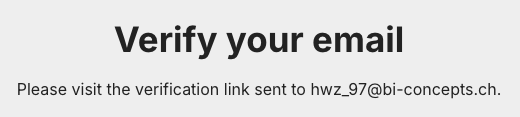
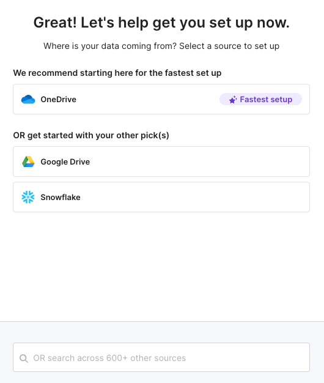
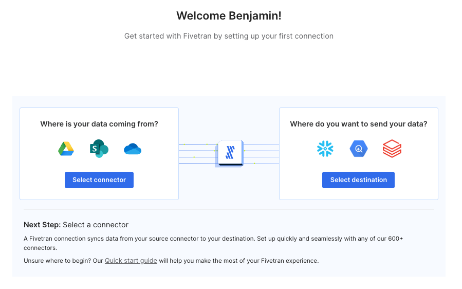
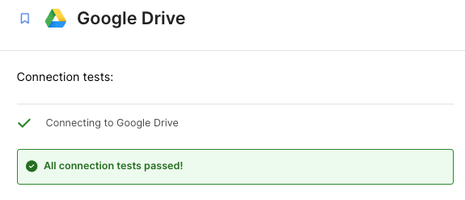
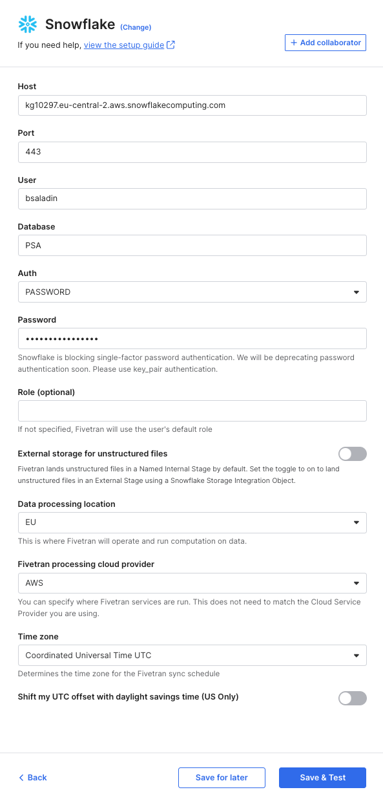
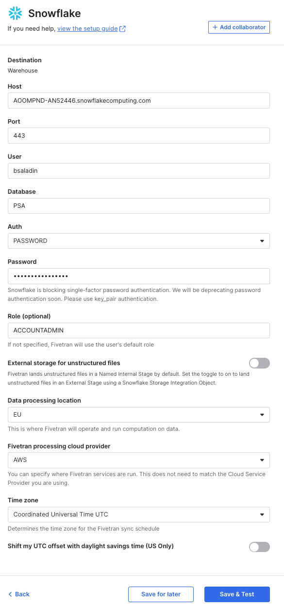
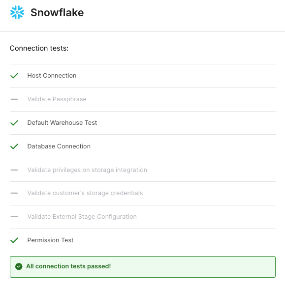
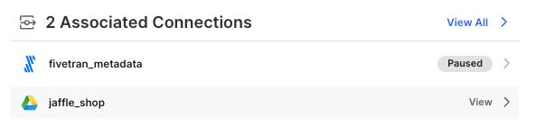
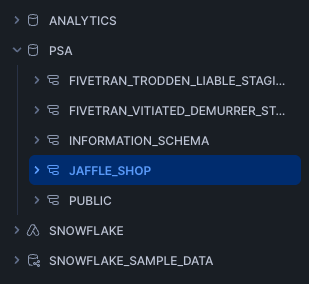

# Fivetran Setup

## 1. Create a Fivetran Account
Fivetran is a cloud-based data integration platform that enables automated data ingestion from various sources.

1. To start using Fivetran, sign up for an account on the [Fivetran website](https://go.fivetran.com/signup/free-trial-emea/){:target="_blank"}.

2. Fill in your credentials and sign up.

    

    

3. Verify your email via the confirmation link you received in your inbox - **Verify my email**.

    

4. After email verification, complete the form with your username and password. Also, agree to Fivetran's terms and conditions. Click **Get Started**.

    

    

5. Skip the next step.

    


---

## 2. Setup a Google Drive Connector
Fivetran enables automated data ingestion from Google Drive.

1. Select **Google Drive** as your data source. You have to select now three connectors you are interested in, please add the Google Drive connector. For the residual two, feel free to choose any connector.

    


    Click **Next**.


2. Select or search for Google Drive.

   


3. Fill out the connector requirements (find here the docs for the [Google Drive connector](https://fivetran.com/docs/connectors/files/google-drive/setup-guide)):

    - **Destination schema**: ```jaffle_shop```
    - **Folder URL**: ```https://drive.google.com/drive/u/0/folders/1Z_U_6SVP6vWXGJWHu9Fl_uUjieyVjaWX```
    - **Data processing location**: ```EU```
    - **Fivetran processing cloud provider**: ```AWS```

    

    Desired state:

    

    **Save & Test** the connector.

4. Click **Save & Test** to verify the connection.

    

    Click **Continue**.

Connector configuration is set up - go to the next step.

---

## 3. Configure Snowflake as the Destination
1. Select **Snowflake** as your destination.

    

    


2. Fill in the required information:
    - **Snowflake Account URL** (e.g. `<account>.snowflakecomputing.com/`| `kg10297.eu-central-2.aws.snowflakecomputing.com`)
    - **Snowflake USER**: `<username>`
    - **Database**: `PSA`
    - **Auth**: set to `PASSWORD`
    - **Password**: `<password>`
    - **Data processing location**: ```EU```
    - **Fivetran processing cloud provider**: ```AWS```
    - **Time Zone**: `UTC`

    Desired state:

    

    - Click **Save & Test**.


    
    - **All connection tests passed!**

    


3. **Continue** and dismiss any pop-ups.


---

## 4. Perform Initial Data Sync
Once connected, start syncing data from **Google Drive to Snowflake**.

1. Click **Start Initial Sync**.

    


2. Monitor progress in the Fivetran dashboard by refreshing the browser from time to time (duration ~1 min).

    

    


3. Once complete, verify that data is ingested into **Snowflake** under the `PSA` (Persistent Staging Area) database.

    

!!! note "Disable Fivetran Sync"
    Feel free to turn off the sync on the top right corner. ``ENABLED`` should be switched to ``PAUSED``.


---


## 5. What we have achieved so far:

<div class="grid cards" markdown>

-   :material-database-check:{ .lg .middle } __Snowflake Ready__

    ---

    - ✅ Snowflake account configured  
    - ✅ Two databases created (ANALYTICS, PSA)  


-   :material-code-tags-check:{ .lg .middle } __dbt Cloud Connected__

    ---

    - ✅ dbt Cloud set up  
    - ✅ Connected to Snowflake  


-   :material-link-variant-plus:{ .lg .middle } __Fivetran Integrated__

    ---

    - ✅ Fivetran account created  
    - ✅ Connected to Snowflake  


-   :material-pipe:{ .lg .middle } __Pipeline Running__

    ---

    - ✅ Fivetran syncing data from Google Drive  
    - ✅ Google Sheets loaded into **jaffle_shop** schema 


</div>

---

## 🚀 Let's take a quick walk through the UI


## 🎉 Next Steps
Now that Fivetran is successfully pulling data into Snowflake, proceed to **dbt transformations**.

🔗 **Continue to:** [Data Integration with dbt](dbt-transformation.md)